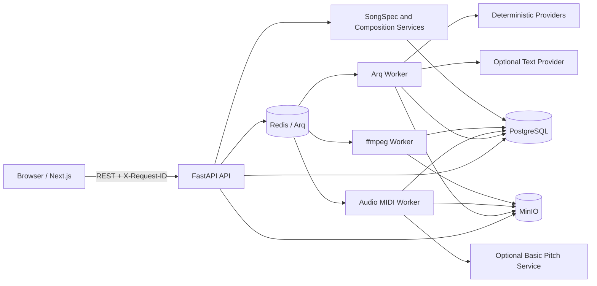
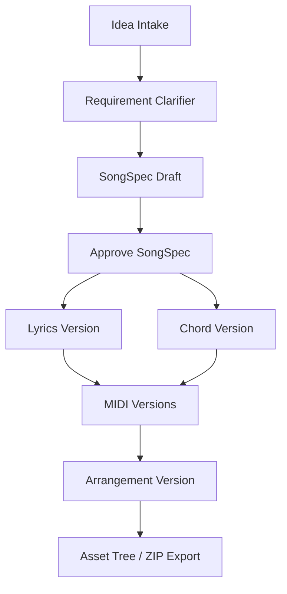
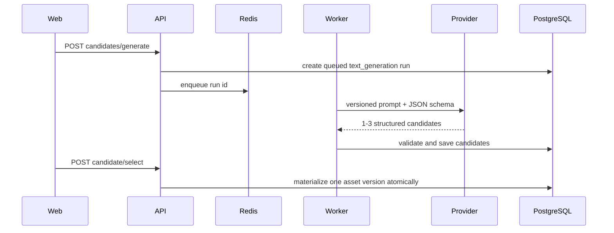
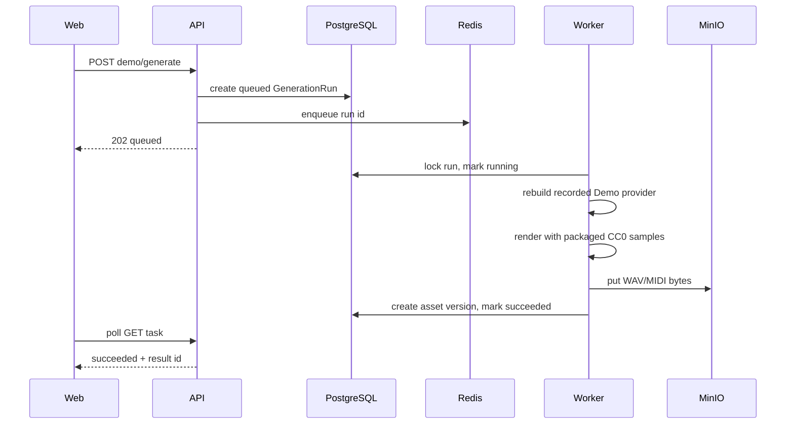

# Abachiwave 架构说明

## 1. 系统边界

Abachiwave 当前是单用户、本地优先的音乐创作产品底座。API 契约和资产版本模型已经稳定；文本创作支持可选的服务端外部 Provider，身份认证、团队权限和外部音乐模型仍不在当前范围。

## 2. 组件职责

### Web

- Next.js App Router + React + TypeScript。
- `useWorkspaceData` 在进入项目时通过单个 `Promise.all` 并行加载项目资源、Provider 能力和生成候选。
- 进入页面后的任务更新只轮询 active run 对应的 `/api/v1/tasks/{id}`；任务进入终态后再做一次完整刷新，避免固定周期重复加载整个工作台。
- `components/workspace` 按 Project Overview、SongSpec、Structure、AI Candidates、Composition、Delivery、Demo、Revision、Audio、Collaboration 拆分。
- Audio、Composition、Demo 和 Revision 面板通过 `next/dynamic` 延迟加载；写操作按业务域维护 pending 状态，互不阻塞无关面板。
- API URL、排序、校验和状态判断位于 `web/src/lib`。
- 下载按钮通过 `fetch -> Blob -> object URL` 保存跨源 API 文件，播放器继续直接使用流式 URL。

### API

- FastAPI 提供版本化 `/api/v1` REST 接口。
- Pydantic v2 schema 负责输入和输出契约。
- SQLAlchemy 2.x AsyncSession 管理事务，Alembic 管理 additive migration。
- Request context middleware 接受或生成 `X-Request-ID`，结构化日志绑定请求、项目和任务标识。
- 列表接口统一使用有上限的 `limit/offset`，常用项目历史查询带复合索引。
- CORS 使用明确的来源、方法和请求头白名单，响应包含 CSP、frame、MIME sniffing 和 referrer 安全头。
- `/health/live` 检查进程；`/health/ready` 检查 PostgreSQL、Redis 和 MinIO。

### Worker

- API 创建 `generation_runs` 并将 Arq job 写入 Redis。
- 通用 Worker 执行文本候选、文本评测、Demo 和参考音频分析，检查取消状态和超时。
- audio-to-MIDI 使用独立 `audio-midi-worker` 和 `arq:audio-midi` 队列；默认执行本地确定性
  Provider，显式配置后通过 HTTP 调用隔离的 Basic Pitch 服务。
- 音频标准化使用独立的 `ffmpeg-worker` Compose profile 和 `arq:audio-ffmpeg` 队列；API/通用 Worker 不消费该队列。
- Provider 与对象存储的同步调用通过线程卸载，避免阻塞事件循环。
- 成功后写入版本元数据；失败或取消时不创建 ready 资产，并尽力清理孤立对象。

### PostgreSQL

保存项目、输入、所有专用资产版本、任务状态、Revision、评论和事件。对象二进制不进入数据库，只保存 storage key、checksum、size 和来源版本标识。

文本生成元数据保存在 `provider_profiles`、`prompt_template_versions` 和
`generation_candidates` 和 `evaluation_runs`。Provider profile 不保存 API key；未选择候选
不会进入正式资产表。评测保存 Prompt/Provider 来源、自动指标和盲评结果，不把私有 A/B
映射暴露给 API 调用方。

### MinIO

保存 MIDI、WAV、上传素材、PCM WAV 派生物和 ZIP 导出包。浏览器不直接依赖公开 bucket，文件统一经 API 下载。

### Redis

只承担 Arq 队列和 Worker 通信。API 进程复用一个延迟创建的 Arq Redis pool，关闭时由 FastAPI lifespan 统一释放。业务事实、任务终态和生成结果均以 PostgreSQL 为准。

## 3. 资产与版本模型

当前使用专用版本表，不引入通用 `ArtifactVersion`：

- `song_spec_versions`
- `lyrics_versions`
- `chord_progression_versions`
- `midi_asset_versions`
- `audio_uploads`：保留 WAV、MP3、M4A、FLAC、OGG 原文件及格式；压缩格式以 `processing -> available | failed` 表达标准化生命周期，解码完成前分析元数据可空。
- `audio_derivatives`：原始 `audio_uploads` 的标准化 PCM WAV 派生物，保存格式、采样率、声道、时长、checksum 和 source checksum。
- `reference_analysis_versions`：参考音频的不可变分析候选，保存源上传/派生物/run、分析范围、Provider 来源、候选字段和置信度。
- `arrangement_plan_versions`
- `audio_demo_versions`
- `audio_markers`

编辑、Revision apply 和 restore 都创建新版本，不覆盖历史。当前资产由聚合服务按以下规则选取：

- approved SongSpec。
- 最新歌词和和弦。
- 每种 MIDI 的最新版本。
- 最新编曲方案和 Demo。

同项目写入新版本前会锁定 `projects` 行，在同一事务读取最大版本号并插入。唯一约束冲突只进行有限重试，耗尽后返回稳定 `409 Conflict`。

SongSpec 同时保留兼容字段 `song_structure` 和规范化的 `structure_sections`。后者为每个段落
提供跨版本稳定的 `section_id`，歌词、和弦和编曲段落引用同一标识。结构编辑先持久化
`structure_change_previews`，不产生资产版本；确认应用时锁定项目、重新校验 SongSpec 与资产
快照，并在单个事务中创建所有受影响的新版本。结构化 MIDI 音符保留来源 `section_id`；Demo
仍然是渲染结果，不保存可编辑的段落级结构，因此 SongSpec 结构变化后必须重新生成 Demo，
不能把旧文件标记为已同步。

歌词版本使用 schema v2 的受控行结构。每个段落同时保存兼容 `text` 与规范化 `lines`；
每一行具有稳定 `line_id`、正文和可选韵脚标记，字符数、单词数、音节、韵脚与重音提示由
schema 计算。旧版本在迁移时获得确定性的行 ID，后续编辑、段落复制和 Revision 会保留来源
行标识，避免仅靠文本位置追踪修改。

歌词编辑器的逐行修改、候选接受、撤销/重做和词汇偏好先保存在浏览器本地草稿。Rewrite
接口可接收当前未保存段落，只返回差异预览，不写入资产表；用户显式保存时才通过 `PATCH`
创建不可变的新歌词版本。页面离开前会提示未保存内容，且本地草稿仅在来源版本 ID 一致时恢复。

和弦版本使用 schema v2 的小节/拍点事件结构，并继续维护兼容的 `bars/chords` 投影。每个事件
具有稳定 `event_id`、拍点、时值、符号和转位；`music21` 理论层统一产生根音、低音、和弦
性质、延伸音、音级集合、试听 MIDI 音高、罗马数字、Nashville 数字谱与借用和弦标记。
旧版本由迁移补齐确定性事件 ID，新写入会拒绝非法符号、越界时值和重叠事件。

和弦本地草稿、撤销/重做和未保存离开提示与歌词编辑器遵循同一语义。预检接口只分析当前
草稿，不创建版本；保存和全曲/段落移调继续创建不可变版本。浏览器仅消费服务端返回的
MIDI 音高，并在用户点击试听时动态加载 Tone.js，提供和弦播放、节拍器与循环。

资产聚合、编曲、Demo 与导出入口都会校验来源 SongSpec。同一 SongSpec 内的歌词、旋律等
局部版本演进可继续复用兼容资产；跨 SongSpec 的 MIDI 或编曲引用会作为缺失前置条件处理，
直到对应资产重新生成，避免历史文件被误当作当前交付链。

音频上传可以挂载用户定义的 `audio_markers`。Marker 只属于一个项目和一个音频上传，保存
秒级位置、标签、可选的段落 ID 和备注；服务端会校验位置不超过音频时长，并通过
`project_events` 记录创建、修改和删除。它们是后续局部分析、波形选区和结构候选的稳定锚点，
不直接修改 SongSpec 或任何资产版本。

工作区的波形支持 Marker 选点和 analysis region 拖选两种交互模式。region 是一次提取请求的
输入，不单独创建可变业务实体；API 会把经过时长边界校验的完整范围写入 `generation_runs`
manifest。Worker 读取标准 PCM WAV 后按帧裁剪，再调用 audio-to-MIDI Provider，因此 Provider
只接收所选片段；生成结果仍通过 manifest 和 `provider_usage.analysis_range` 保留相对原音频的
时间来源。未指定 region 时也会保存显式的 full-range manifest，旧任务则兼容回退到完整时长。

参考音频分析复用同一套范围解析和标准 PCM 来源选择，但使用独立的
`AudioAnalysisProvider` contract。当前 `local_deterministic_reference_analysis` 基线 Provider
只处理 PCM 数据，稳定产生 tempo/beat、拍号、key/mode、音域、响度/能量、结构、和弦、乐器
与制作特征候选。Worker 必须按 run 中记录的 Provider 名称和版本重建实现；来源不匹配时任务
明确失败，不静默切换算法。每次成功任务创建新的 `reference_analysis_versions` 版本，并把
源 checksum、实际分析范围、输入/输出字节和结果 ID 写入 manifest 或 `provider_usage`。

分析结果只作为候选展示，不自动写入正式资产。逐字段应用先返回影响预览；确认后仅把选择的
tempo、key、time signature 写入一个新的 SongSpec draft 子版本，现有 approved SongSpec 和其
歌词、和弦、MIDI、编曲关联保持不变。这条边界确保低置信度分析不会越过用户确认，也保留了
后续重新生成受影响资产所需的清晰来源链。

audio-to-MIDI 通过 `AudioToMidiProvider` contract 接入。默认
`local_monophonic_wav_to_midi` 保留为离线测试基线；`spotify_basic_pitch` 通过专用 Python 3.11
HTTP sidecar 执行模型推理，模型依赖不会进入主 Python 3.12 API/Worker 环境。sidecar 在进程
启动时加载模型，并用单并发锁控制推理；上传仅接受受大小限制的 WAV，返回值必须同时满足
服务版本头和 MIDI 文件签名契约。容器为非 root 进程显式提供可写的临时 Numba cache，避免
Librosa 首次 JIT 初始化依赖只读 site-packages。Basic Pitch 参数先合并默认值并做名称、类型、
边界及频率范围校验，未知参数明确拒绝，避免 lineage 记录了实际未生效的配置。Provider HTTP
超时必须比任务超时至少短 15 秒。

创建 run 时就固定 upload、可选 PCM derivative、可选 reference analysis、两级 checksum、
分析范围和 Provider identity。`audio-midi-worker` 只消费专用队列，并按 run 记录重建 Provider；
显式来源不匹配即失败。成功后 `midi_asset_versions` 保存 `source_audio_upload_id`、
`source_reference_analysis_id` 和完整 `source_provider_manifest`，后续编辑、变换、Revision 与
restore 继续继承这些字段。旧排队任务缺少新增 checksum 字段时从其不可变上传/派生记录解析，
但已有值不匹配时绝不回退。

Basic Pitch 的 HTTP timeout、连接失败和非法响应分别写入稳定任务错误码。Worker 收到优雅关闭
取消时把仍在 `queued/running` 的任务标记为 `task_interrupted`；执行器只接受 active 状态，因而
重启后 Redis 中残留或重投的旧消息不能再次物化终态资产。失败、取消和中断路径都在写对象前
检查终态，数据库提交失败后仍执行尽力对象清理。

## 4. 同步创作链路

现有直接生成接口继续使用确定性 Agent。AI Candidates 链路可选择服务端配置的外部
Provider，也可以使用本地 deterministic fallback；两者都通过同一 Pydantic schema 校验。
四个直接生成接口只有在显式传入 `provider_profile_id` 或 `candidate_count` 时切换为异步
候选模式，因此旧客户端的响应形状保持不变。

## 5. AI 候选链路

SongSpec、歌词、编曲和 Revision 使用独立 Prompt 模板。输出解析只允许一次有限 JSON
提取修复，随后必须通过对应 Pydantic schema；失败 run 记录稳定 `error_code`。

固定 `creative-briefs-v1` 样例集包含 32 条用例，每个 workflow 8 条。Evaluation Worker
逐条调用同一 Provider contract，记录 schema 合法率、约束遵循率、段落完整率、重复度和
token usage；Provider 输出与 deterministic baseline 以稳定但隐藏的 A/B 顺序提供人工盲评。
Prompt 或模型升级应建立新 EvaluationRun，并与历史基线比较，而不是只检查接口成功。

## 6. 异步生成链路

合法主状态路径为 `queued -> running -> succeeded | failed | cancelled`。Worker 在 Provider 前、对象写入前和数据库提交前检查取消状态。

Demo 生成通过 `MusicGenerationProvider` 抽象。默认的 `local_deterministic_wav` 实现使用随包分发的 CC0 鼓采样，并在本地确定性合成贝斯、和弦垫和旋律；通过 `DEMO_PROVIDER_NAME` 选择 Provider。API 和 Worker 启动时会校验配置，创建任务时把 Provider 名称、版本和参数写入 `generation_runs`，Worker 以该记录为来源重建 Provider。无法重建的未知 Provider 会明确失败，不会静默回退到其他实现，从而保护 Demo 的来源追溯。

音频标准化通过 `FfmpegAudioConverter` 抽象调用 `ffmpeg` 的 pipe 输入/输出：`-map_metadata -1 -vn -acodec pcm_s16le -ar 48000 -ac 2 -f s16le`。API 只校验文件名、MIME 和魔数，不在请求进程内调用 ffmpeg；MP3、M4A、FLAC、OGG 上传后自动进入独立队列。转换器不接收 shell 字符串，超时、二进制缺失、解码失败和非法输出都会转换为稳定错误；原始上传永远不被覆盖。工作区和 audio-to-MIDI 对压缩源优先读取 ready PCM WAV 派生文件。

Basic Pitch 推理同样不进入 API 或通用 Worker。选择 `spotify_basic_pitch` 时，API 把 run 写入
`arq:audio-midi`，专用 Worker 从 MinIO 读取并按范围裁剪标准 PCM WAV，再通过固定 multipart
HTTP 契约调用 sidecar；sidecar 只返回 MIDI bytes 和受控统计头，数据库与对象存储仍只由
Abachiwave Worker 写入。

## 7. 存储一致性

- 上传和 Worker 生成采用“先写对象，再提交 ready 元数据”。
- 数据库提交失败时，调用 `delete_bytes` 尽力删除已写对象。
- 下载时同时校验项目归属和元数据，避免跨项目访问。
- 上传、下载和 ZIP 归档按块传输；ZIP 使用可落盘的临时缓冲并受 `MAX_EXPORT_BUNDLE_BYTES` 限制，避免大文件链路常驻内存。
- `checksum` 和 `size_bytes` 用于导出与排障，不替代对象存储自身完整性机制。
- `MAX_PROJECT_UPLOADS` 和 25 MB 单文件上限控制本地素材增长。
- `scripts/audit_storage.py` 对比数据库 storage key 与 MinIO inventory；默认只读，显式指定 `--delete-orphans` 才删除孤立对象。

## 8. 可观测性

- HTTP: `request_id`、method、route、status。
- 项目操作: `project_id`、artifact/revision id。
- Worker: `generation_run_id`、project id、结果资产 id。
- `project_events` 记录关键业务动作，供 handoff、导出和试用复盘使用。

日志不应记录完整歌词、上传音频内容、数据库 URL 或对象存储密钥。

## 9. 测试层次

- 单元/API: SQLite + ASGI，覆盖 schema、服务、状态机和快速迁移 smoke。
- Integration CI: PostgreSQL、Redis、MinIO、API、Worker 和真实对象文件。
- Browser CI: Chromium 桌面/移动端、失败恢复和完整 MVP UI 链路。
- Agent evaluation: 32 条固定样例作为离线 deterministic 基线；真实 Provider 评测通过显式
  服务端配置运行，目标 schema 合法率不低于 98%。
- `scripts/smoke_mvp.py`: 真实 HTTP、并发版本写入、WAV/MIDI/ZIP 内容检查。
- `support/benchmark_audio_to_midi.py`: 版本化 WAV/MIDI 真值集、秒级音符匹配、分类阈值、
  推理时延和 Basic Pitch 容器资源基准；manifest 强制验证真实数据集许可证/来源 URL 及逐文件
  SHA-256。`support/fetch_nsynth_benchmark_subset.py` 可流式构建有固定 archive ETag 的 acoustic
  单音观察集；`support/fetch_guitarset_benchmark_subset.py` 校验 Zenodo metadata 后通过 HTTPS
  Range 构建带 JAMS lineage 的真实 solo/comp 乐句集。资源采样轮询 Docker 快照，规避 Windows
  Docker CLI 对无限流输出的缓冲。manifest 支持多参考 MIDI 和逐样本 A_max 选择；完整 Vocadito
  数据集保留两位音乐家标注，并用独立一致性报告校验转换口径。
- `support/sweep_basic_pitch_parameters.py`: 读取版本化候选定义，按 `singer_id` 等 group attribute
  做稳定 development/holdout 划分；同组样本不会跨分区。候选只按 development macro offset F1
  排序，随后比较 baseline 与入选候选的 holdout 表现。每个候选保存独立报告并核对有效参数与样本
  清单后才允许复用，防止重复运行时混入旧结果。

## 10. 当前限制

- 匿名单用户模式，无正式认证和授权。
- 外部文本 Provider 需要显式环境配置；无配置时完整链路使用本地确定性 fallback。
- 真实 Provider 的人工质量优势必须由盲评提交证明；离线测试只能证明 contract 和基线稳定。
- Demo 和 reference analysis Provider 仍是本地确定性实现；Demo 已使用 CC0 采样驱动渲染，
  两者都不代表商业生成或分析质量。audio-to-MIDI 已有可选 Basic Pitch 实现和 NSynth acoustic
  单音、GuitarSet solo/comp 和 Vocadito 40 条真实演唱观察基线。Vocadito 歌手隔离扫描证明提高
  onset threshold 能把留出集 macro offset F1 从 0.363 提升到约 0.410，但仍低于 0.50 观察目标；
  当前需要完成尾部曲线和替代 Provider 比较，再在目标环境确定正式质量与容量门禁。
- MP3、M4A、FLAC、OGG 依赖独立 ffmpeg Worker 标准化；Docker/ffmpeg 不可用时无法完成解码。
- 无 GPU、Stem、DAW 工程或公开分享页。
- 专业编辑器已完成统一段落时间线、歌词逐行工具、和弦网格试听，以及结构化 MIDI 钢琴卷帘、音符编辑、变换和 Tone.js 试听。
- Compose 默认凭据、开发服务器和绑定挂载仅适合本地或受控环境。
