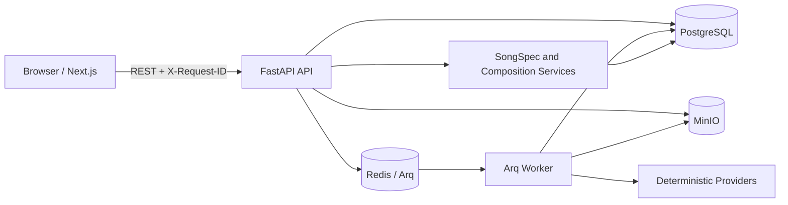
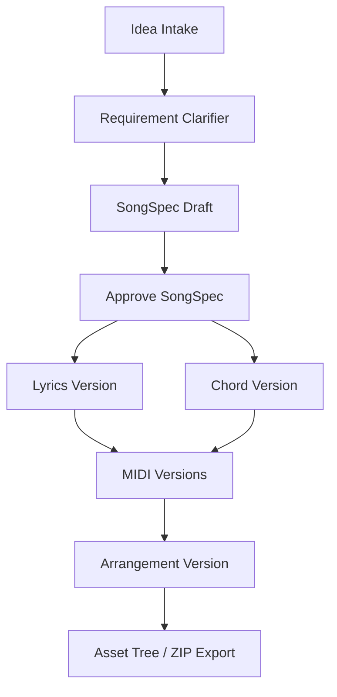
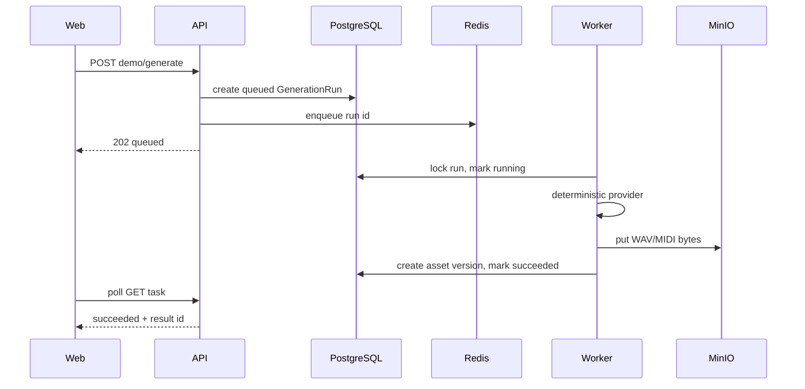

# Abachiwave 架构说明

## 1. 系统边界

Abachiwave 当前是单用户、本地优先的音乐创作 MVP。API 契约和资产版本模型已经稳定，但身份认证、团队权限、真实 LLM 和外部音乐模型不在当前范围。

## 2. 组件职责

### Web

- Next.js App Router + React + TypeScript。
- `useWorkspaceData` 在进入项目时通过单个 `Promise.all` 并行加载 17 组独立资源。
- `components/workspace` 按 Project Overview、SongSpec、Composition、Delivery、Demo、Revision、Audio、Collaboration 拆分。
- API URL、排序、校验和状态判断位于 `web/src/lib`。
- 下载按钮通过 `fetch -> Blob -> object URL` 保存跨源 API 文件，播放器继续直接使用流式 URL。

### API

- FastAPI 提供版本化 `/api/v1` REST 接口。
- Pydantic v2 schema 负责输入和输出契约。
- SQLAlchemy 2.x AsyncSession 管理事务，Alembic 管理 additive migration。
- Request context middleware 接受或生成 `X-Request-ID`，结构化日志绑定请求、项目和任务标识。
- `/health/live` 检查进程；`/health/ready` 检查 PostgreSQL、Redis 和 MinIO。

### Worker

- API 创建 `generation_runs` 并将 Arq job 写入 Redis。
- Worker 执行 Demo 生成和 audio-to-MIDI，检查取消状态和超时。
- Provider 与对象存储的同步调用通过线程卸载，避免阻塞事件循环。
- 成功后写入版本元数据；失败或取消时不创建 ready 资产，并尽力清理孤立对象。

### PostgreSQL

保存项目、输入、所有专用资产版本、任务状态、Revision、评论和事件。对象二进制不进入数据库，只保存 storage key、checksum、size 和来源版本标识。

### MinIO

保存 MIDI、WAV、上传素材和 ZIP 导出包。浏览器不直接依赖公开 bucket，文件统一经 API 下载。

### Redis

只承担 Arq 队列和 Worker 通信。业务事实、任务终态和生成结果均以 PostgreSQL 为准。

## 3. 资产与版本模型

当前使用专用版本表，不引入通用 `ArtifactVersion`：

- `song_spec_versions`
- `lyrics_versions`
- `chord_progression_versions`
- `midi_asset_versions`
- `arrangement_plan_versions`
- `audio_demo_versions`

编辑、Revision apply 和 restore 都创建新版本，不覆盖历史。当前资产由聚合服务按以下规则选取：

- approved SongSpec。
- 最新歌词和和弦。
- 每种 MIDI 的最新版本。
- 最新编曲方案和 Demo。

同项目写入新版本前会锁定 `projects` 行，在同一事务读取最大版本号并插入。唯一约束冲突只进行有限重试，耗尽后返回稳定 `409 Conflict`。

## 4. 同步创作链路

确定性 Agent 和 Provider 只基于用户输入及已批准资产生成草稿，不调用外部模型。

## 5. 异步生成链路

合法主状态路径为 `queued -> running -> succeeded | failed | cancelled`。Worker 在 Provider 前、对象写入前和数据库提交前检查取消状态。

## 6. 存储一致性

- 上传和 Worker 生成采用“先写对象，再提交 ready 元数据”。
- 数据库提交失败时，调用 `delete_bytes` 尽力删除已写对象。
- 下载时同时校验项目归属和元数据，避免跨项目访问。
- `checksum` 和 `size_bytes` 用于导出与排障，不替代对象存储自身完整性机制。
- `MAX_PROJECT_UPLOADS` 和 25 MB 单文件上限控制本地素材增长。

## 7. 可观测性

- HTTP: `request_id`、method、route、status。
- 项目操作: `project_id`、artifact/revision id。
- Worker: `generation_run_id`、project id、结果资产 id。
- `project_events` 记录关键业务动作，供 handoff、导出和试用复盘使用。

日志不应记录完整歌词、上传音频内容、数据库 URL 或对象存储密钥。

## 8. 测试层次

- 单元/API: SQLite + ASGI，覆盖 schema、服务、状态机和快速迁移 smoke。
- Integration CI: PostgreSQL、Redis、MinIO、API、Worker 和真实对象文件。
- Browser CI: Chromium 桌面/移动端、失败恢复和完整 MVP UI 链路。
- `scripts/smoke_mvp.py`: 真实 HTTP、并发版本写入、WAV/MIDI/ZIP 内容检查。

## 9. 当前限制

- 匿名单用户模式，无正式认证和授权。
- Provider 为本地确定性草稿，不代表商业生成质量。
- 只分析 WAV，不支持 MP3/M4A 解码。
- 无 GPU、Basic Pitch、Stem、DAW 工程或公开分享页。
- Compose 默认凭据、开发服务器和绑定挂载仅适合本地或受控环境。
